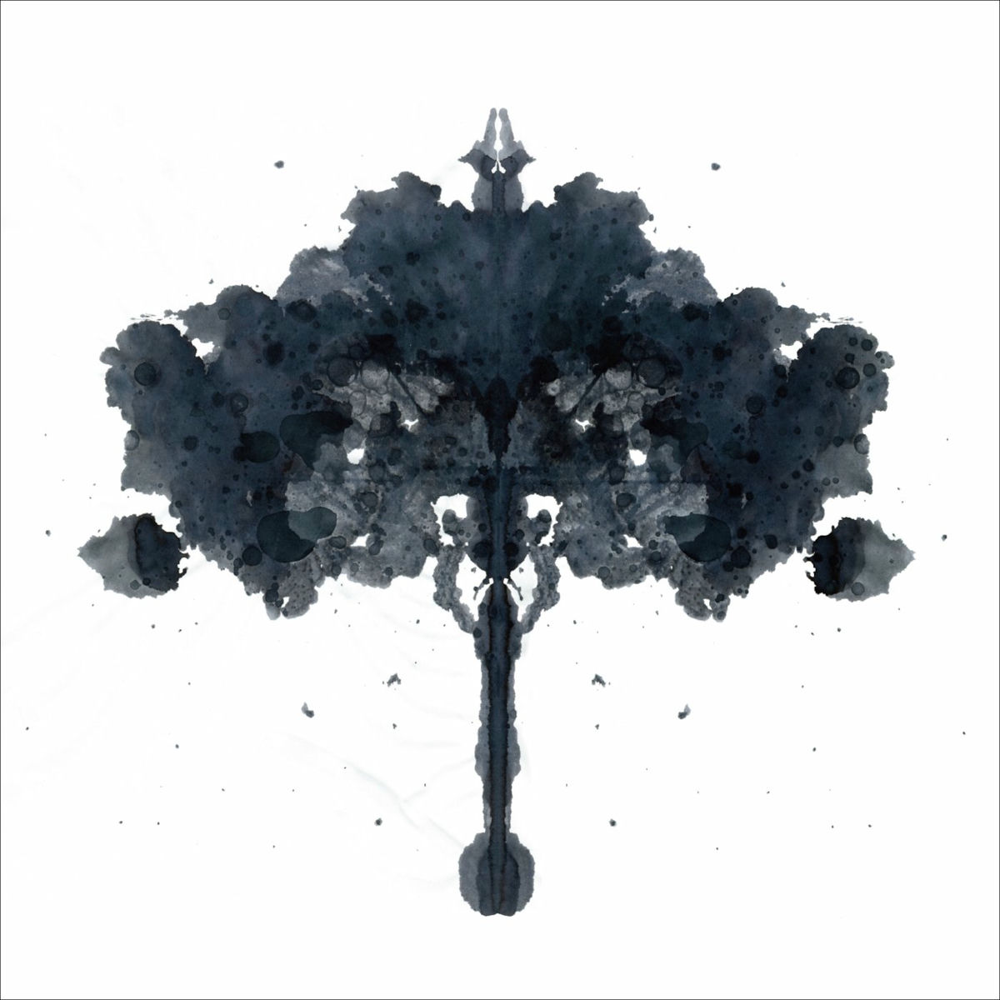

# Curriculum Vitae

> **Meshkov Dmitriy**  
> Student at Belarusian-Russian University  
> Major: Computer Science and Computer Engineering

---

##  Contact Information

| Method | Details |
|--------|---------|
|  Phone | [+375 25 543-90-62](tel:+375255439062) |
|  Email | [10negative10@gmail.com](mailto:10negative10@gmail.com) |
|  Telegram | [@furfze](https://t.me/furfze) |
|  GitHub | [github.com/blablabla](https://github.com/blablabla) |

---

##  About Me

I am a student at the Belarusian-Russian University, majoring in Computer Science and Computer Engineering. I am kind, helpful, and work hard to help those I can. I am diligently studying programming for professional growth and development.

---

##  Technical Skills

- **Proficient in**: `C#`
- **Currently learning**: `C`, `C++`
- **Basic knowledge**: `HTML`, `CSS`
- **Tools**: `Git`, `Visual Studio`

---

##  Code Example

```csharp
string name = "Dmitriy";
string surname = "Meshkov";
string fullName = name + " " + surname;
Console.WriteLine("Hello, I am " + fullName);

---

##  Projects & Experience

### Console Application "Cars"

- **Description**: Console-based database application with file persistence
- **Functionality**: Add, view, sort, search, and edit car records
- **Technologies**: `C#`, `File I/O`, `Collections`
- **Source code**: [GitHub Link](https://github.com/blablabla)

### WinForms Desktop Application

- **Description**: GUI application with JSON data storage
- **Functionality**: Permanent data storage, user-friendly interface
- **Technologies**: `C#`, `WinForms`, `JSON`, `Serialization`
- **Source code**: [GitHub Link](https://github.com/blablabla)

> **Note**: This CV itself is my first published project on GitHub Pages

---

##  Completed Courses

-  Physics Course — Completed
-  Mathematics Course — Completed
-  Ongoing: Advanced C++ Programming (self-study)

---

##  English Language

- **Level**: B1 (Intermediate)
- **Experience**: Technical documentation reading, English-language tutorials and courses

---

##  Photo



*To view this photo, ensure photo.jpg is in the same directory*

---

<small>© 2026 Dmitry Meshkov. All rights reserved.  
Last updated: March 9, 2026</small>